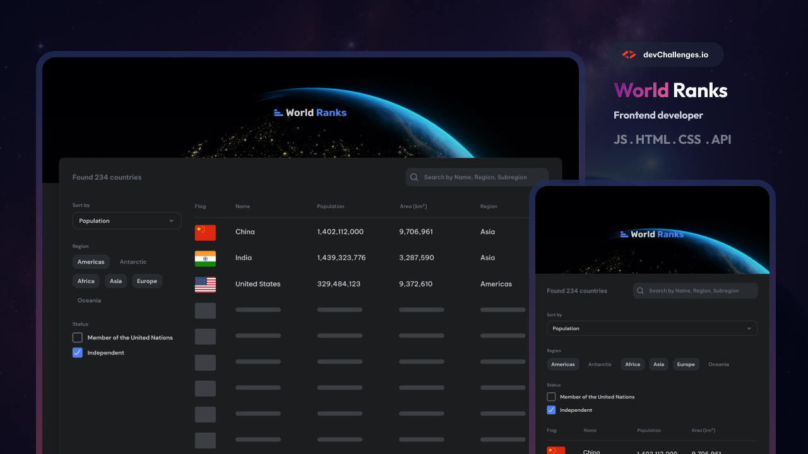

<h1 align="center">{country-page-master} | devChallenges</h1>

<div align="center">
   Solution for a challenge <a href="https://devchallenges.io/challenge/country-page" target="_blank">Country Page - WorldRanks
</a> .
</div>

<div align="center">
  <h3>
    <a href="{https://ostkreuzzz.github.io/vue-countries/}">
      Demo
    </a>
    <span> | </span>
    <a href="{https://github.com/Ostkreuzzz/vue-countries}">
      Solution
    </a>
    <span> | </span>
    <a href="https://devchallenges.io/challenge/country-page">
      Challenge
    </a>
  </h3>
</div>

# Country Page - WorldRanks 🌍



## About the Project

The **Country Page - WorldRanks** project provides users with detailed information about countries, including population, region, subregion, and more. This app is fully responsive and works seamlessly across various devices.

## Built With

- [Vue 3](https://vuejs.org/)
- [Vite](https://vitejs.dev/)
- [Vue Router](https://router.vuejs.org/)
- [Rest Countries API](https://restcountries.com/)
- [Tailwind CSS](https://tailwindcss.com/)

## Features

- 🌍 Fetch and display information about countries from the Rest Countries API.
- 🔎 Search for countries by name.
- 🗂️ Filter countries by region.
- 📱 Fully responsive design.

### Installation

1. Clone the repository:
   ```bash
   git clone https://github.com/Ostkreuzzz/vue-countries.git
   cd vue-countries
   ```

### Built with

- Prime Vue UI
- Axios
- REST API
- CSS custom properties
- Flexbox
- [Vue.js](https://vuejs.org/)
- [Tailwind](https://tailwindcss.com/)
